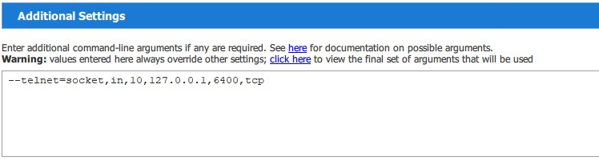

# Remote Control Joystick

This is the second milestone in the 'Advanced Programming 2' course. A remote control joystick is a android application used to control a flight in FG simulator. The project use MVVM pattern, and write in java.

In this [link](https://www.youtube.com/watch?v=ihzss1QK-Og) you can see video that explain about using the app. 

# Settings

Before you begin, you need to find the IP address that the simulator listens to. Here is an example of ip 127.0.0.1.
Open the FG simulator, and go to the 'Setting' section. Under 'Additional Settings', Type the following line:


```bash
--telnet=socket,in,10,127.0.0.1,6400,tcp
```



## How to Use?

First use a IDE that runs an Android emulator (for example android studio). Note that the app will work best with screens larger than 5 inches.

After running the application on the emulator, enter ip and port in the appropriate fields, and click connect. Now a connection has been established between the app and the simulator, and from now on you can use the joystick and seekbars to control the plane.


## Developers
* Oz Browner
* Or Yaniv
